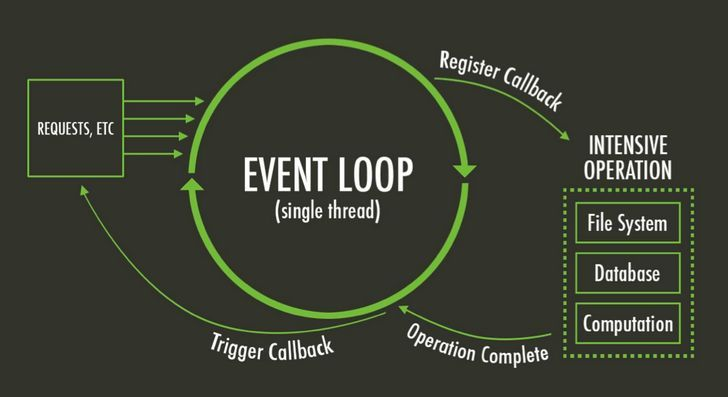

# Event-Loop là gì?

**TL;DR**: _Event-loop là mô hình lý thuyết bao gồm **Stack** để chứa function call \(Frame\),  **Queue** để chứa Event \(click, scroll. hover...\), **Heap** chứa thông tin dữ liệu \(data, object...\). Event-Loop là 1 tiến trình loop liên tục để kiểm tra Event Queue có đang trống hay đang có event chưa được xử lý. Nếu có event, và stack trống, thì event sẽ được đẩy vào Stack để xử lý function tương ứng của event._

Visualization ở [đây](http://latentflip.com/loupe/?code=ZnVuY3Rpb24gcHJpbnRIZWxsbygpIHsNCiAgICBjb25zb2xlLmxvZygnSGVsbG8gZnJvbSBiYXonKTsNCn0NCg0KZnVuY3Rpb24gYmF6KCkgew0KICAgIHNldFRpbWVvdXQocHJpbnRIZWxsbywgMzAwMCk7DQp9DQoNCmZ1bmN0aW9uIGJhcigpIHsNCiAgICBiYXooKTsNCn0NCg0KZnVuY3Rpb24gZm9vKCkgew0KICAgIGJhcigpOw0KfQ0KDQpmb28oKTs%3D!!!PGJ1dHRvbj5DbGljayBtZSE8L2J1dHRvbj4%3D)

## Giới thiệu

**Event-Loop** là một trong những khái niệm quan trọng nhất của **JavaScript** \(JS\). Bài viết này cố gắng cung cấp một lời giải thích ngắn gọn và dễ hình dung nhất về Event-Loop nói riêng và JS nói chung. Để đảm bảo tính dễ hiểu, bài viết giả định người đọc chỉ có những kiến thức cơ bản nhất về lập trình với JavaScript.

Do hạn chế về kiến thức và thời gian của người viết, mọi ý kiến đóng góp sửa chữa đều được hoan ngênh, thông qua tạo issue tại [repo gitbook của blog](http://github.com/vutran1710/journals).

## Event-loop

Tham khảo: [MDN Official: EventLoop](https://developer.mozilla.org/en-US/docs/Web/JavaScript/EventLoop)

Mô hình lý thuyết của Event-loop được áp dụng trong các JavaScript Engine hiện nay gồm 3 thành phần chính: [**Stack**, **Queue**](https://journal.vutr.io/go/khoa-hoc-may-tinh-co-ban#stack-va-queue) và **Heap**

#### Heap

Heap là phần không gian bộ nhớ trong Ram chứa các thông tin dữ liệu \(data, object...\) đang được sử dụng trong quá trình hoạt động của trang web. Trong Heap, dữ liệu là không có thứ tự _\(unordered data structure\)._

#### Stack và Stack Frame

Mỗi một hàm Javascript khi được gọi \(function call\) sẽ tạo ra một Frame trong Stack. Một function có thể bao hàm nhiều function call bên trong. Việc gọi các function bên trong sẽ tạo ra các stack frame mới trong stack. Khi một function được thực hiện xong và trả về kết quả, frame của nó cũng được loại bỏ khỏi stack \(nguyên tắc LIFO\).

Khi số lượng frame vượt quá giới hạn của stack \(lỗi overflow\), browser sẽ văng ra lỗi **Maximum Call Stack Exceed \(Chrome\).** Một hàm đệ quy \(recursion\) không được xử lý điều kiện tốt thường sẽ gây ra lỗi này.

#### Queue và Event

Queue chỉ nhận vào các event \(click, hover, scroll, ajax request...\) được gắn kèm handling function. Một event click không có hàm xử lý sự kiện \(event handler\) sẽ được bỏ qua. 

Khi javascript engine chạy, nó sẽ liên tục kiểm tra trong Queue có event hay không. Nếu có, event cũ nhất trong Event Queue sẽ được remove khỏi Queue \(nguyên tắc FIFO\) để đẩy vào Stack - nếu như Stack đang trống \(không có bất cứ function nào đang được thực thi\), function trong Event này sẽ được gọi. 

Trong trường hợp Stack vẫn còn frame, event tiếp theo trong event queue sẽ phải đợi. Do đó, việc thực hiện các tác vụ nặng và đòi hỏi thời gian tính toán quá lâu sẽ dẫn đến tình trạng _blocking_ \(trình duyện treo/không thể tương tác\), gây ra trải nghiệm không tốt cho người dùng nên không được khuyến khích.

\(..tbc\)

