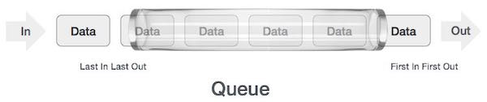

# Khoa học máy tính cơ bản

## Giới thiệu

Những kiến thức cơ bản nhất về Khoa học máy tính **Computer Science** sẽ được gom tại đây, phục vụ mục đích review lại kiến thức, cũng như làm tham chiếu cơ sở cho những bài viết nâng cao hơn về sau.

## Cấu trúc dữ liệu

### Stack và Queue

**Stack** là một mô hình dữ liệu dạng nhóm của từ 0 đến X phần tử, và có 2 thao tác xử lý bao gồm:

1. **Push**: thêm 1 phần tử mới vào nhóm
2. **Pop**: bỏ phần tử mới nhất ra khỏi nhóm

Cơ chế hoạt động của stack được biết đến nhiều nhất với tên gọi First-In-Last-Out \(FILO\), nghĩa là phần tử đầu tiên được thêm vào nhóm sẽ là phần tử cuối cùng được loại ra, và ngược lại \(Last-In-First-Out\).

**Queue** cũng là một mô hình dữ liệu dạng nhóm, nhưng có trình tự xử lý phần tử khác với stack. Trong mô hình Queue, trật tự phần tử \(order\) được đảm bảo theo nguyên tắc: phần tử đầu tiên được thêm vào cũng sẽ là phần tử đầu tiên được rút ra. Việc xử lý queue cũng gồm 2 thao tác:

1. **Enqueue**: thêm phần tử mới vào nhóm
2. **Dequeue**: loại bỏ phần tử cũ nhất ra khỏi nhóm

Queue và Stack có thể có 4 trạng thái: rỗng\(_empty_\), không-rỗng\(_non-empty/underflow_\), đầy\(_full_\) và tràn\(_overflow_\) - dựa trên tương quan giữa kích cỡ \(_capacity_\) của Queue/Stack và tổng số phần tử thực tế nhận vào. Khi số lượng phần tử ít hơn hoặc bằng kích cỡ của Queue/Stack, trạng thái lỗi overflow sẽ không xảy ra, ngoại trừ tình huống sau:

Cho một Array rỗng có size = 7. Enqueue tương đương thêm vào array một phần tử, và dequeue tương đương bỏ đi phần tử gần index 0 \(head\) của array nhất.

1. Khi thêm phần tử A \(enqueue\),  index của phần tử A là 0
2. Khi thêm phần tử tiếp theo B, index của B là 1
3. Thực hiện liên tiếp việc enqueue, đến khi array đã đầy, ví dụ ta có:

Lúc này, ta ko thể enqueue thêm nữa. Tuy nhiên giả sử ta dequeue lần lượt 3 phần tử đầu tiên \(index 0, 1, 2\)...

Mặc dù queue đã trống, nhưng vẫn không thể thêm được phần tử nữa và lỗi overflow sẽ xảy ra nếu thực hiện enqueue. Đây là điểm hạn chế của queue thông thường. 

Để giải quyết tình huống này, giải pháp tự nhiên là thêm phần tử vào đầu Queue. Câu trúc này được biết đến với tên gọi là **Circular Queue.**

**Circular Queue \(hay Ring-Buffer\)**

