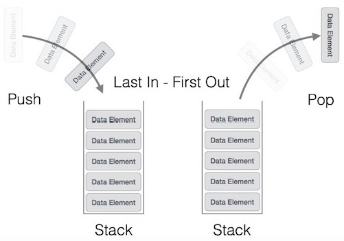

# Khoa học máy tính cơ bản

## Giới thiệu

Những kiến thức cơ bản nhất về Khoa học máy tính **Computer Science** sẽ được gom tại đây, phục vụ mục đích review lại kiến thức, cũng như làm tham chiếu cơ sở cho những bài viết nâng cao hơn về sau.

## Cấu trúc dữ liệu

### Stack và Queue

**Stack** là một mô hình dữ liệu dạng nhóm của từ 0 đến X phần tử, và có 2 thao tác xử lý bao gồm:

1. **Push**: thêm 1 phần tử mới vào nhóm
2. **Pop**: bỏ phần tử mới nhất ra khỏi nhóm

Cơ chế hoạt động của stack được biết đến nhiều nhất với tên gọi First-In-Last-Out \(FILO\), nghĩa là phần tử đầu tiên được thêm vào nhóm sẽ là phần tử cuối cùng được loại ra, và ngược lại \(Last-In-First-Out\).

**Queue** cũng là một mô hình dữ liệu dạng nhóm, nhưng có trình tự xử lý phần tử khác với stack. Trong mô hình Queue, trật tự phần tử \(order\) được đảm bảo theo nguyên tắc: phần tử đầu tiên được thêm vào cũng sẽ là phần tử đầu tiên được rút ra. Việc xử lý queue cũng gồm 2 thao tác:

1. **Enqueue**: thêm phần tử mới vào nhóm
2. **Dequeue**: loại bỏ phần tử cũ nhất ra khỏi nhóm

Queue và Stack có thể có 4 trạng thái: rỗng\(_empty_\), không-rỗng\(_non-empty/underflow_\), đầy\(_full_\) và tràn\(_overflow_\) - dựa trên tương quan giữa kích cỡ \(_capacity_\) của Queue/Stack và tổng số phần tử thực tế nhận vào. Về cơ bản, khi số lượng phần tử ít hơn hoặc bằng kích cỡ của Queue/Stack, trạng thái lỗi overflow sẽ không xảy ra, ngoại trừ trong trường hợp của **Circular Queue**, khi Queue là vòng tròn khép kín.

#### Circular Queue \(hay Ring-Buffer\), và tại sao cần Circular Queue

Cho 1 Queue X rỗng có capacity = n. Có thể thấy:

1. Khi thêm phần tử A \(enqueue\),  index của phần tử A là 0
2. Khi thêm phần tử tiếp theo B, index của A tăng 1 đơn vị, và index của B lúc này là 0
3. Thực hiện liên tiếp việc enqueue, đến khi X đã đầy, ta có:

