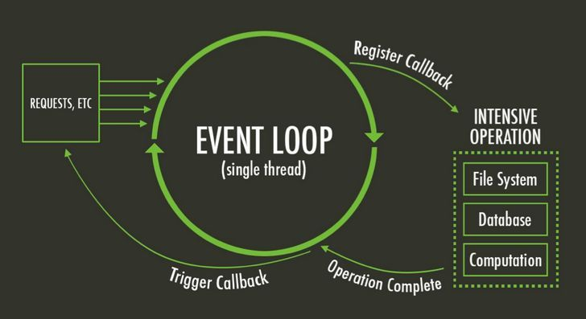
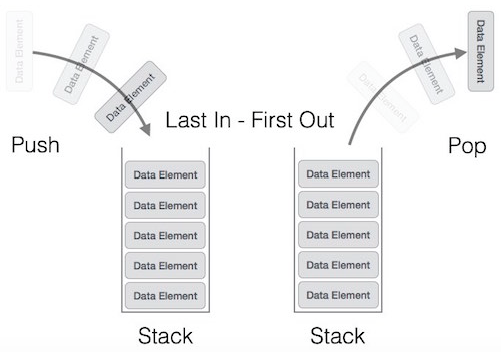

# Event-Loop là gì?

## Giới thiệu

**Event-Loop** là một trong những khái niệm quan trọng nhất của \*JavaScript\*\(JS\), nhưng lại không dễ để hiểu một cách đầy đủ và dễ dàng. Dù đã có vô số bài viết kỹ thuật cố gắng giải thích về Event-loop, nhưng hầu hết đều khó tiếp cận \(bất đồng ngôn ngữ, cách diễn đạt, mức độ sâu sắc của người viết…\).

Bài viết này cố gắng cung cấp một lời giải thích ngắn gọn và dễ hình dung, nhưng đi từ cốt lõi vấn đề cũng như những yếu tố xung quanh cần lưu tâm khi lập trình với Event-Loop nói riêng và JS nói chung. Để đảm bảo tính dễ hiểu, bài viết giả định người đọc chỉ có những kiến thức cơ bản nhất về lập trình với JavaScript.

Do hạn chế về kiến thức và thời gian của người viết, mọi ý kiến đóng góp sửa chữa đều được hoan nghênh.

Bài viết được lưu tại:

1. discord channel **vietnam**
2. [http://journal.vutr.io](http://journal.vutr.io)

## Tổng quát

Tham khảo: [MDN Official: EventLoop](https://developer.mozilla.org/en-US/docs/Web/JavaScript/EventLoop)

Để hiểu về Event-Loop, trước hết ta cần hiểu một số khái niệm cơ bản nhất của máy tính và lập trình, bao gồm Stack, Queue, RAM.

### Stack và Queue

**Stack** là một mô hình dữ liệu dạng nhóm của từ 0 đến X phần tử, và có 2 thao tác xử lý bao gồm:

1. **Push**: thêm 1 phần tử mới vào nhóm
2. **Pop**: bỏ phần tử mới nhất ra khỏi nhóm

Cơ chế hoạt động của stack được biết đến nhiều nhất với tên gọi First-In-Last-Out \(FILO\), nghĩa là phần tử đầu tiên được thêm vào nhóm sẽ là phần tử cuối cùng được loại ra, và ngược lại \(Last-In-First-Out\).

**Queue** cũng là một mô hình dữ liệu dạng nhóm, nhưng có trình tự xử lý phần tử khác với stack. Trong mô hình Queue, trật tự phần tử \(order\) được đảm bảo theo nguyên tắc: phần tử đầu tiên được thêm vào cũng sẽ là phần tử đầu tiên được rút ra. Việc xử lý queue cũng gồm 2 thao tác:

1. **Enqueue**: thêm phần tử mới vào nhóm
2. **Dequeue**: loại bỏ phần tử cũ nhất ra khỏi nhóm

Queue và Stack có thể có 4 trạng thái: rỗng\(empty\), không-rỗng\(non-empty/underflow\), đầy\(full\) và tràn\(overflow\), dựa trên tương quan giữa kích cỡ nhóm \(collection-size\) của Queue/Stack và tổng số phần tử thực tế nhận vào. Về cơ bản, khi số lượng phần tử ít hơn hoặc bằng kích cỡ \(size\) của Queue/Stack, trạng thái lỗi overflow sẽ không xảy ra, ngoại trừ trong trường hợp của **Circular Queue**, khi tập nhóm elements là một vòng tròn khép kín.

